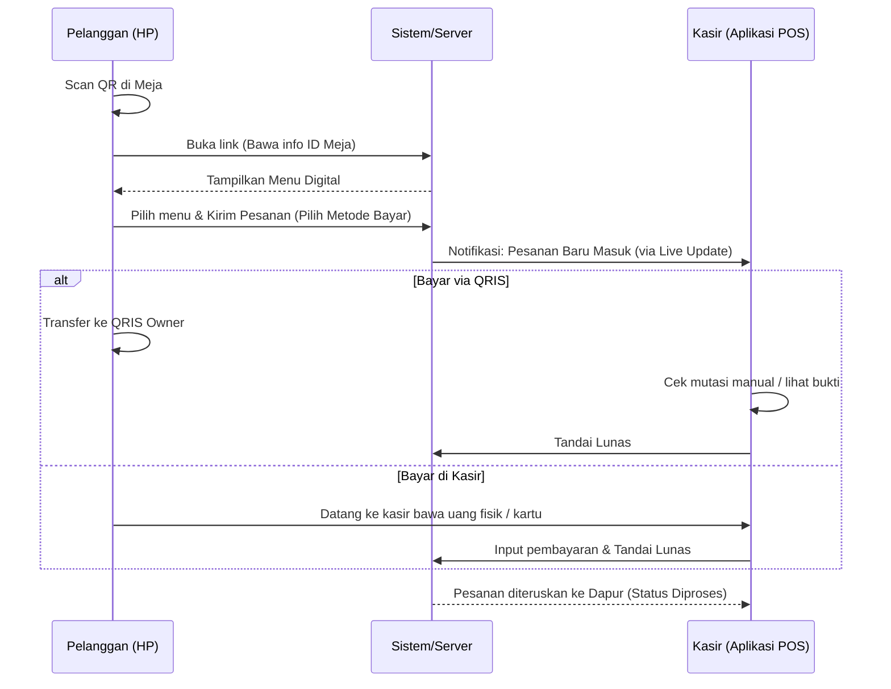
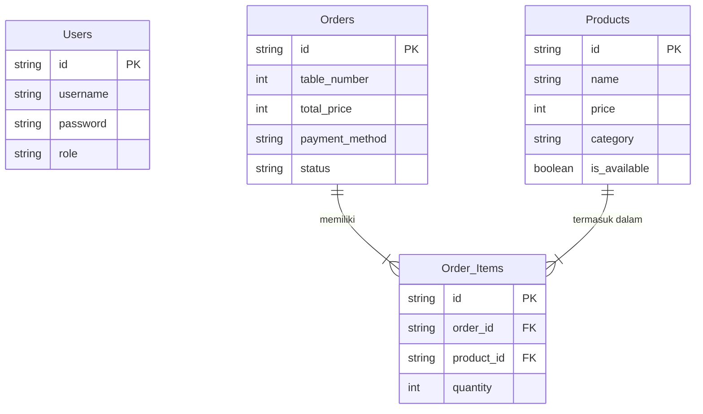

# PRD — Project Requirements Document

## 1. Overview
Banyak kafe masih menggunakan sistem pemesanan manual yang memakan waktu, di mana pelanggan harus menunggu pelayan atau antre di kasir hanya untuk melihat menu. Aplikasi ini hadir untuk menyelesaikan masalah tersebut dengan menyediakan sistem POS (Point of Sales) terintegrasi yang memiliki fitur *self-service ordering*. 

Tujuan utama dari aplikasi ini adalah mempermudah operasional kafe. Pelanggan tidak perlu mengunduh aplikasi apa pun (tanpa hambatan/frictionless); mereka cukup memindai (scan) QR code di meja menggunakan kamera HP, melihat menu, membuat pesanan, dan memilih metode pembayaran. Di sisi lain, kasir memiliki aplikasi dasbor untuk mengelola dan memproses pesanan tersebut secara efisien.

## 2. Requirements
- **Berbasis Web (Web-Based):** Sisi pelanggan harus berupa halaman web responsif agar bisa diakses langsung dari *browser* HP setelah memindai QR code, tanpa perlu *install* aplikasi.
- **Identifikasi Meja Otomatis:** Setiap QR code di meja menyimpan informasi nomor meja, sehingga saat pelanggan memindai, pesanan otomatis terhubung dengan nomor meja tersebut.
- **Pilihan Pembayaran:** Sistem harus mendukung opsi pembayaran mandiri via QRIS (disediakan oleh pemilik kafe) atau bayar langsung di kasir.
- **Dasbor Kasir Real-time:** Pesanan dari pelanggan harus langsung muncul di layar kasir tanpa perlu memuat ulang (refresh) halaman secara manual.

## 3. Core Features
**Sisi Pelanggan (Customer Web):**
- **Scan QR & Menu Digital:** Memindai barcode di meja untuk membuka menu interaktif (mirip sistem Mie Gacoan) lengkap dengan foto, harga, dan nama menu.
- **Keranjang Pesanan:** Menambahkan dan mengatur jumlah makanan/minuman sebelum melakukan pemesanan.
- **Checkout & Pembayaran:** Mengirim pesanan dan memilih metode pembayaran (QRIS Langsung atau Bayar di Kasir).

**Sisi Kasir/Admin (POS App):**
- **Manajemen Pesanan Aktif (Live Orders):** Melihat daftar pesanan masuk lengkap dengan rincian menu dan nomor meja.
- **Konfirmasi Pembayaran:** Melanjutkan atau menyelesaikan proses pembayaran bagi pelanggan yang memilih "Bayar di Kasir", atau memverifikasi pembayaran bagi yang menggunakan "QRIS".
- **Manajemen Menu (Admin):** Menambah, mengubah, atau menghapus menu serta memperbarui ketersediaan (stok habis/tersedia).

## 4. User Flow
**Perjalanan Pelanggan:**
1. Pelanggan duduk di meja.
2. Memindai QR Code yang ada di meja menggunakan kamera HP.
3. Halaman web menu kafe terbuka (nomor meja otomatis tercatat).
4. Pelanggan memilih makanan/minuman dan menambahkannya ke keranjang.
5. Pelanggan menekan tombol "Pesan" dan memilih metode (QRIS atau Kasir).
6. Pesanan terkirim dan pelanggan tinggal menunggu pesanannya diantarkan.

**Perjalanan Kasir:**
1. Kasir *login* ke dalam aplikasi POS kafe.
2. Saat ada pesanan dbuat oleh pelanggan, pesanan baru muncul di layar kasir (lengkap dengan pesanan dan nomor meja).
3. Jika pelanggan memilih "Bayar di Kasir", kasir akan menagih saat pelanggan ke meja kasir dan menekan tombol "Selesaikan Pembayaran".
4. Jika pelanggan memilih "QRIS", kasir mengecek mutasi/bukti bayar, lalu menekan tombol "Verifikasi Pembayaran".

## 5. Architecture
Berikut adalah gambaran sistem bagaimana pelanggan dan kasir saling berinteraksi menggunakan aplikasi ini.

## 6. Database Schema
Database berfungsi sebagai lemari penyimpanan digital. Berikut adalah tabel-tabel utama yang dibutuhkan:

1. **Users (Pengguna Internal):** Menyimpan data pegawai/kasir untuk otentikasi.
   - `id`: ID unik pengguna
   - `username`: Nama akun kasir
   - `password`: Kata sandi (terenkripsi)
   - `role`: Peran (Contoh: Kasir, Admin)
2. **Products (Menu):** Menyimpan daftar makanan dan minuman.
   - `id`: ID unik menu
   - `name`: Nama makanan/minuman
   - `price`: Harga menu
   - `category`: Kategori (Makanan, Minuman, Snack)
   - `is_available`: Status ketersediaan (Ya/Tidak)
3. **Orders (Pesanan Utama):** Menyimpan data pesanan per meja.
   - `id`: Nomor pesanan unik
   - `table_number`: Nomor meja pelanggan
   - `total_price`: Total harga pesanan
   - `payment_method`: Metode bayar (QRIS / Kasir)
   - `status`: Status pesanan (Menunggu Pembayaran, Dibayar, Diproses, Selesai)
4. **Order_Items (Rincian Pesanan):** Menyimpan detail menu apa saja yang dibeli dalam satu pesanan.
   - `id`: ID unik rincian
   - `order_id`: Terhubung ke ID Pesanan
   - `product_id`: Terhubung ke ID Menu
   - `quantity`: Jumlah porsi yang dipesan

**Diagram Relasi Database (ERD):**

## 7. Tech Stack
Mengingat belum ada teknologi spesifik yang dipilih dan aplikasi ini butuh keseimbangan antara kecepatan pengembangan, performa, dan biaya (ramah untuk usaha kafe), berikut adalah rekomendasi teknologinya:

- **Frontend & Backend (Fullstack Framework):** **Next.js** — Sangat handal untuk membangun halaman web pelanggan yang cepat dibuka serta dasbor kasir yang responsif dalam satu tempat.
- **Desain UI/Tampilan:** **Tailwind CSS + shadcn/ui** — Membuat tampilan web menu yang cantik, rapi, dan terlihat modern (seperti aplikasi profesional) dengan cepat.
- **Database:** **SQLite** — Mengingat ini untuk satu kafe, SQLite sangat ringan, cepat, dan tidak memerlukan server database yang mahal. (Dapat di-_upgrade_ ke PostgreSQL jika usaha mulai bercabang).
- **ORM (Penghubung Database):** **Drizzle ORM** — Aman, cepat, dan mudah digunakan untuk berinteraksi dengan database.
- **Otentikasi (Login Sistem):** **Better Auth** — Untuk mengamankan akses ke dasbor Kasir/Admin.
- **Deployment (Hosting):** **Vercel** — Platform terbaik dan termudah untuk menghosting aplikasi Next.js (bisa menggunakan paket gratis/murah di awal).